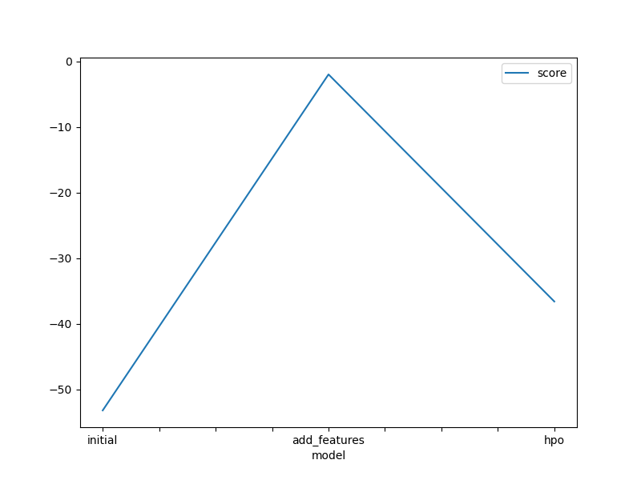
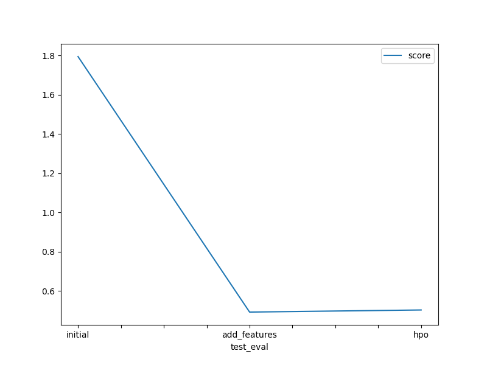

# Report: Predict Bike Sharing Demand with AutoGluon Solution
#### Sayed Salem

## Initial Training
### What did you realize when you tried to submit your predictions? What changes were needed to the output of the predictor to submit your results?
I needed to convert all predictions with values less than zero to be zero because kaggle rejects any prediction with this values

### What was the top ranked model that performed?
WeightedEnsemble_L3

## Exploratory data analysis and feature creation
### What did the exploratory analysis find and how did you add additional features?
I changed the `datetime` column and convert to 6 columns with names year, month, day, hour, minutes, seconds and dropped the datetime column and also i converted session and weather to be categorical type and that made the model get score better

### How much better did your model preform after adding additional features and why do you think that is?
the kaggle score before was 1.79461 and after the score became 0.49184 so the score increased

## Hyper parameter tuning
### How much better did your model preform after trying different hyper parameters?
I tried to give hyperparameters to some models not all but the model score is decreased a little bit and score became 0.50256 after it was 0.49184 

### If you were given more time with this dataset, where do you think you would spend more time?
I will try to handle outliers and make more analysis to the features to make it better and to get score better

### Create a table with the models you ran, the hyperparameters modified, and the kaggle score.
| model        | WeightedEnsemble_L3                                                                                        | WeightedEnsemble_L2                                                                                        | CatBoost_BAG_L1                                                                                           |   score |
|:-------------|:-----------------------------------------------------------------------------------------------------------|:-----------------------------------------------------------------------------------------------------------|:----------------------------------------------------------------------------------------------------------|--------:|
| initial      | {'use_orig_features': False, 'max_base_models': 25, 'max_base_models_per_type': 5, 'save_bag_folds': True} | {'use_orig_features': False, 'max_base_models': 25, 'max_base_models_per_type': 5, 'save_bag_folds': True} | {'use_orig_features': True, 'max_base_models': 25, 'max_base_models_per_type': 5, 'save_bag_folds': True} | 1.79461 |
| add_features | {'use_orig_features': False, 'max_base_models': 25, 'max_base_models_per_type': 5, 'save_bag_folds': True} | {'use_orig_features': False, 'max_base_models': 25, 'max_base_models_per_type': 5, 'save_bag_folds': True} | {'use_orig_features': True, 'max_base_models': 25, 'max_base_models_per_type': 5, 'save_bag_folds': True} | 0.49184 |
| hpo          | {'use_orig_features': False, 'max_base_models': 25, 'max_base_models_per_type': 5, 'save_bag_folds': True} | {'use_orig_features': False, 'max_base_models': 25, 'max_base_models_per_type': 5, 'save_bag_folds': True} | {'use_orig_features': True, 'max_base_models': 25, 'max_base_models_per_type': 5, 'save_bag_folds': True} | 0.50256 |

### Create a line plot showing the top model score for the three (or more) training runs during the project.

### Create a line plot showing the top kaggle score for the three (or more) prediction submissions during the project.

## Summary
At the end in this project 
First, I used autogloun to solve this problem and first i trained the autogloun with default values and default parameters and without handling the features of the dataset and got result and sumbitted the result
Second, I added additional features to the dataset and coverted two columns to different type and trained model and then got a higher score and submitted the final score 
Third, I give a values as a hyperparameter to autogloun to try to get higher score then i trained the model then it gave me score a little bit of the second model and then i submitted the final score.
